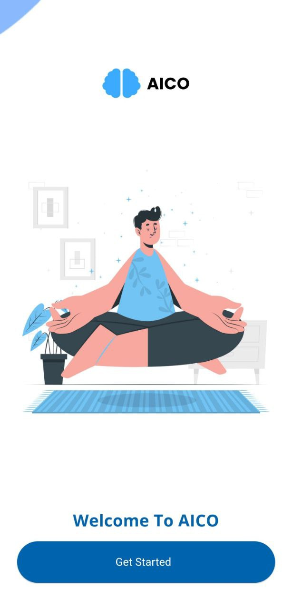
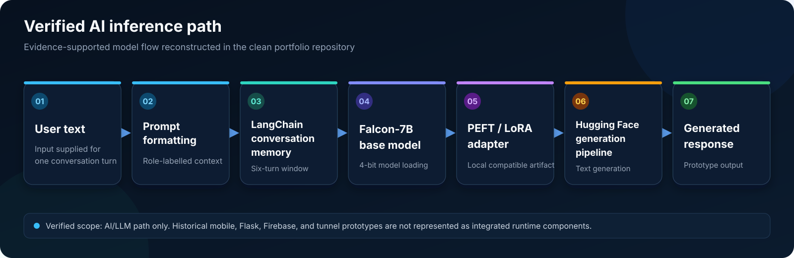
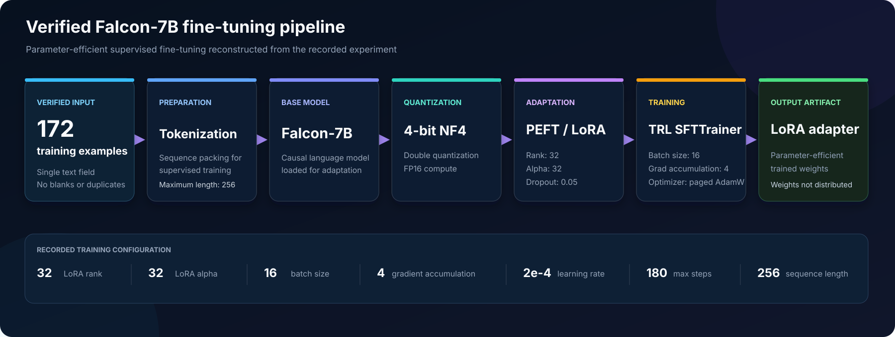
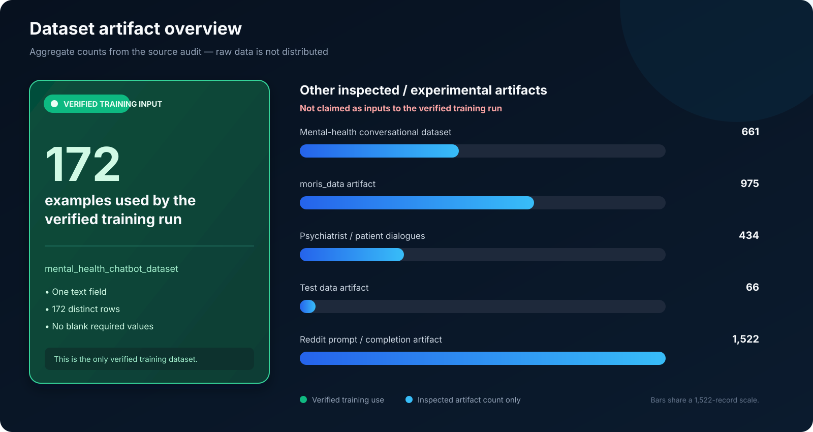
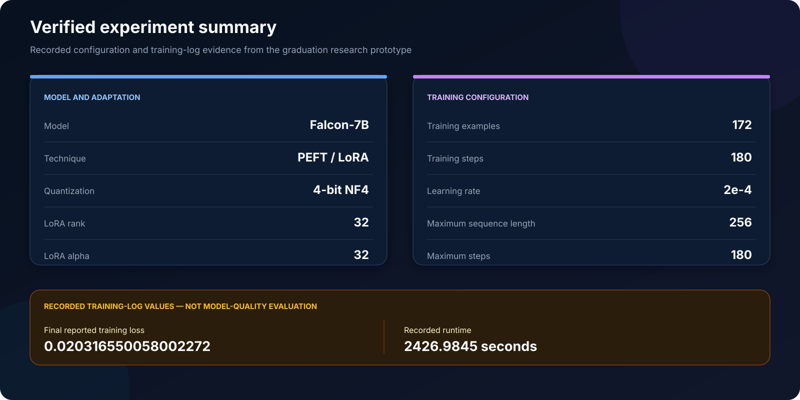

# AICO - Artificial Intelligence for psyChOtherapy

A graduation research prototype exploring conversational mental-health support with
Falcon-7B, parameter-efficient LoRA fine-tuning, 4-bit NF4 quantization, and bounded
conversational memory.

This public rebuild isolates the evidence-supported AI/LLM work from historical mobile,
backend, and cloud prototypes that were not verified as one end-to-end system.

> **Research and education only.** AICO is not a medical product, clinical treatment,
> crisis service, or replacement for a qualified mental-health professional.

## Mobile UI Prototype

<p align="center">
  
</p>

<p align="center"><em>Reviewed splash-screen prototype from the mobile UI exploration. This is not evidence of a deployed production application or verified mobile-to-model integration.</em></p>

## AI/LLM highlights

- Falcon-7B causal language model with PyTorch and Hugging Face Transformers
- PEFT/LoRA adaptation with rank 32 and alpha 32
- 4-bit NF4 loading with double quantization and FP16 compute
- TRL `SFTTrainer` reconstruction of the verified 172-example run
- Hugging Face text-generation pipeline with a local compatible LoRA adapter
- LangChain `ConversationBufferWindowMemory` with a six-turn window
- Configuration-driven loading with no model initialization at import time
- Non-model tests for configuration, prompting, safe paths, and repository hygiene

## Verified architecture



The diagram shows only the evidence-supported AI path. Historical mobile, Flask,
Firebase, and local-tunnel work is intentionally excluded from the runtime flow because
the available evidence does not establish a complete integrated system.

The clean implementation keeps model loading explicit:

- `src/aico/config.py` validates model, adapter, training, and generation settings.
- `src/aico/prompting.py` builds role-labelled prompts from bounded recent context.
- `src/aico/inference.py` loads a 4-bit Falcon base model and compatible local adapter.
- `src/aico/training.py` reconstructs the supervised fine-tuning experiment.

## Fine-tuning pipeline



The pipeline reconstructs the recorded experiment; it does not distribute model weights,
adapters, raw data, or training outputs.

## Training configuration

| Setting | Verified value |
| --- | --- |
| Base model | `vilsonrodrigues/falcon-7b-instruct-sharded` |
| Dataset | `heliosbrahma/mental_health_chatbot_dataset` |
| Training examples | 172 |
| LoRA rank / alpha / dropout | 32 / 32 / 0.05 |
| Quantization | 4-bit NF4, double quantization, FP16 compute |
| Per-device batch size | 16 |
| Gradient accumulation | 4 |
| Optimizer | `paged_adamw_32bit` |
| Learning rate | `2e-4` |
| Maximum steps | 180 |
| Maximum sequence length | 256 |

The training module checks that the selected split still contains 172 examples. If the
remote dataset changes, it stops rather than presenting a different run as the verified
experiment.

## Dataset overview



Only the 172-example dataset is verified as input to the recorded training run. The other
counts describe inspected or experimental artifacts and are not combined training
evidence. Raw datasets are not published, and licensing, redistribution, privacy,
consent, and generation provenance are not fully verified for every historical artifact.

See the [dataset card](docs/dataset-card.md) for aggregate-only documentation.

## Experiment summary



The final reported loss of `0.020316550058002272` and runtime of `2426.9845` seconds are
recorded training-log values only. They do not establish generalization, response quality,
therapeutic value, clinical effectiveness, or safety.

There is no verified accuracy, BLEU, ROUGE, BERTScore, perplexity, clinical validation,
documented human-scored evaluation, baseline comparison, or production deployment. See
the [experiment card](docs/experiment-card.md) for the complete evidence boundary.

## Repository structure

```text
assets/
  diagrams/           Verified architecture and fine-tuning pipeline visuals
  figures/            Dataset and experiment evidence summaries
  screenshots/        Reviewed mobile UI prototype image
configs/               Verified training and inference settings
docs/                  Architecture, dataset, experiment, provenance, and safety records
src/aico/              Clean configuration, prompting, training, and inference modules
tests/                 Non-model unit and repository-security tests
pyproject.toml          Package metadata and dependencies
SECURITY.md             Credential, data, and artifact handling policy
```

Model weights, adapters, datasets, notebooks, academic reports, presentations, private
screenshots, executables, and service credentials are intentionally excluded.

## Prototype boundaries

- The mobile image documents a UI prototype, not a complete Flutter application.
- No mobile-to-Flask-to-Falcon integration is claimed.
- No Firebase-backed inference is claimed.
- No public or production deployment is claimed.
- No continuous-availability claim is made.
- No motivational interviewing capability or verified CBT effectiveness is claimed.

See [prototype boundaries](docs/prototype-boundaries.md) and the
[evidence-based architecture](docs/architecture.md).

## Safety and limitations

AICO is not medical diagnosis, clinical treatment, crisis support, a replacement for a
mental-health professional, or a clinically validated system. The prompt includes basic
role and crisis-language boundaries, but prompt wording is not a validated safety layer.

See [safety and limitations](docs/safety-and-limitations.md) and the repository
[security policy](SECURITY.md).
